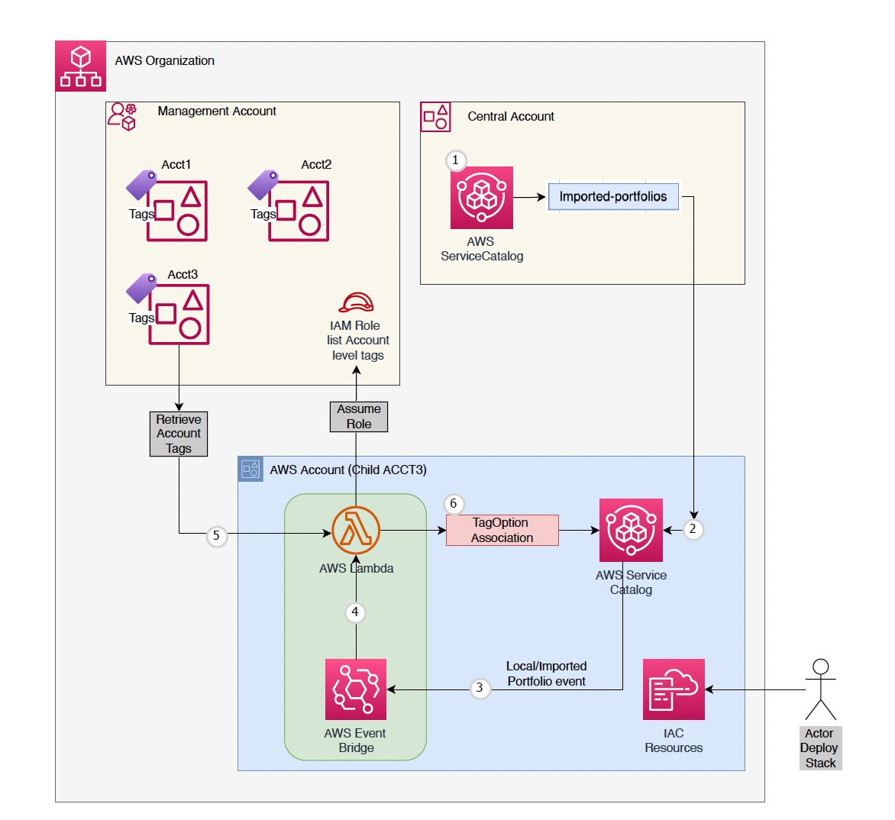

// Copyright Amazon.com, Inc. or its affiliates. All Rights Reserved.
// SPDX-License-Identifier: MIT-0
# Automated ResourceManagement for AWS Service Catalog Portfolios tags association from Account Tags using Lambda Function

## Description

This project is designed to automate associating account level tags to shared and local portfolios in the AWS environment which inturn inherits the tags to launched resources. AWS ServiceCatalog TagOption feature is used for this association. 

## Pre-requisities

* Management Account - Permission to deploy Cross Account Role Access and Update Cost Allocation Tag Status for account tags using AWS Cloudformation stack. 
* Shared or Delegated Admin Account - Permission to deploy the solution IaC to multiple child or OUs using AWS Cloudformation StackSet. It also requires admin access to AWS Service Catalag. 
* Member Accounts - Admin access to AWS Service Catalog. 

## Architecture that covers the Resource Tagging functionality

## Deployment

1. In Management Account- Create cloudformation stack using the template `01-mgmt_account_setup_stack.yaml` with parameters

    a. <b>AllowedMemberAccountIds</b> : List of member account Ids. If no ID is specified it will limit the scope to its own account. 

    b. <b>AllowedOrgIds</b>: Atleast one Org ID should be provided. 

2. In Centra Admin/Shared Service or Management account - Create Cloudformation StackSet to deploy the template `02-account-tag-association-stackset.yaml` with 

    a. <b>OrganizationCrossAccountTrusteeRole</b> : IAM Role created in previous steps

    b. <b>MgmtAccountId </b>: Provide management account id

## Security

This is proof-of-concept code not to be directly deployed to production. Please work with your security team to add the appropriate controls to the solution:
1. <b> Access control:</b> Review and set entitlements for the IAM principals respecting the least-privilege principle.
 
2. <b>Other security configuration:</b> Review configuration of all resources, to comply with your security requirements such as Lambda runtime version, Lambda environment varible encryption.
 
3. <b>Security Scanning:</b> Use `ash` to scan the repository to uncover security findings and remediations.
 
    <code> ash --source-dir <REPLACE_WITH_LOCAL_REPO_DIRECTORY> </code>
https://github.com/awslabs/automated-security-helper

See [CONTRIBUTING](CONTRIBUTING.md#security-issue-notifications) for more information.

## Solution in Member Account

1. <b>Event Rule:</b> `aws-acct-tag-associate-<REGION>-event-rule` Monitors for "New" or "Accept Portfolio share" events to invoke the Lambda for Tag Association.
2. <b>Lambda Function:</b> `aws-acct-tag-associate-<REGION>-function` Assumes a role in the management account to list account specific(member) tags. The function also retrieves tag options from AWS Service Catalog service. If a tag option does not exist in the listed account specific tags, the function creates a new one and associates it with the imported and local portfolios.

### Note: 
Lambda functions provided are for Proof of Concept purposes only, not to be used in productions. We recommend revision of the lambda function configuration to comply with your security requirements such as logging, monitoring, environment variable encryption, runtime versions, concurrency, running in VPC.

3. <b> Custom Resource: </b> `custom-invocation-firsttime-<REGION>-function` Sets up a Lambda trigger that invokes another lambda function as soon as the deployment of lambda is complete to associate tags to existing portfolios (one time invocation)

## Solution in Management Account

1. <b> Roles:</B> `org-cross-account-trustee-role` Trusted role to allow members to assume the role
2. <b> Event Rule:</b> `aws-ce-lambda-schedule-run-<REGION>-event-rule` Scheduled event to update cost allocation tag status
3. <b> Lambda Function:</b> `update-cost-allocation-tag-status-<REGION>-function` Extracts account level tags and activate Cost Allocation Status Tag

### Note: Lambda function configuration
Lambda functions provided are for POC purposes only, not to be used in productions. We recommend revision of the lambda function configuration to comply with your security requirements such as logging, monitoring, environment variable encryption, runtime versions, concurrency, running in VPC.

## Testing

<b> Test portfolio tags in Admin & Member accounts </b>

1. In central or admin account 
    a. Create new portfolio in AWS Service Catalog.
    b. Share the portfolio to child account.
2. In member account 
    a. Accept the shared portfolio or 
    b. Create a new local portfolio 
    c. Monitor AWS Cloud Watch logs of lambda function 
    d. Validate account level tags associated to the AWS Service Catalog TagOptions Library 
    e. Validate Portfolios associated with new TagOptions
3. Testing is successful if all portfolios are associated with its acccount level tags.    
<i>Note: Portfolio tags are automatically inherited to any resources launched by end users via AWS Service Catalog service. </i>

<b> Validate CostAllocation Tag Activation in Management Account </b>

1. Scheduler is expected to run on scheduled window. In our case it is 11AM. 
2. Go to Billing -> CostAllocationTag in AWS Console to view the activation of account level tags. 
<i> Note: New account tags will take atleast one day to reflect in billing portal. </i>

## Troubleshooting

In case of any issues with the Cloudformation stack or the lambda function deployment, refer to the CloudWatch logs or Cloudformation event logs for detailed error messages. 

## Cleanup

To cleanup the resources created by this cloudformation stack - 

1. Access the AWS Cloudformation service in AWS Management Console. 
2. Delete the cloudformation stack that was created using this template

This will remove all the resources created by the stack. 
## Conclusion

The AWS Lambda function, deployed using AWS Cloudformation stack, automates the management of portfolios tag associations within AWS environement. 

## License

This library is licensed under the MIT-0 License. See the LICENSE file.
